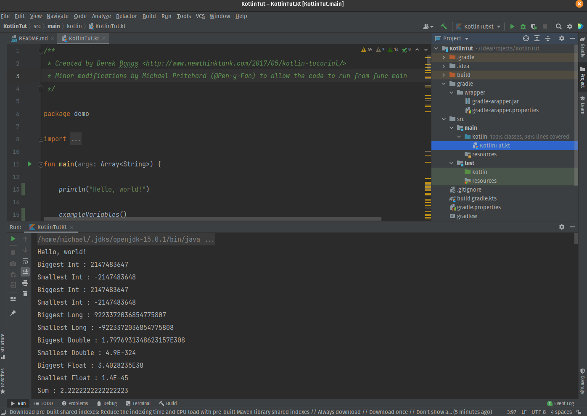

# Kotlin Tut

- Original source [Kotlin tutorial](http://www.newthinktank.com/2017/05/kotlin-tutorial/) by Derek Banas

There is a little modification to the original file to allow it to work as a single main function, otherwise the source 
is the same as this file.

See the video above to find out how to setup Kotlin and Intellj IDEA Community Edition.

Once Intellj is setup, clone the project, then navigate to the src > kotlin > kotlinTut.kt 
file, right click within fun main and run 

## Clone or Download this Project from GitHub

See [Cloning a repository](https://help.github.com/en/articles/cloning-a-repository) for details on how to create a
local copy of this project on your computer.